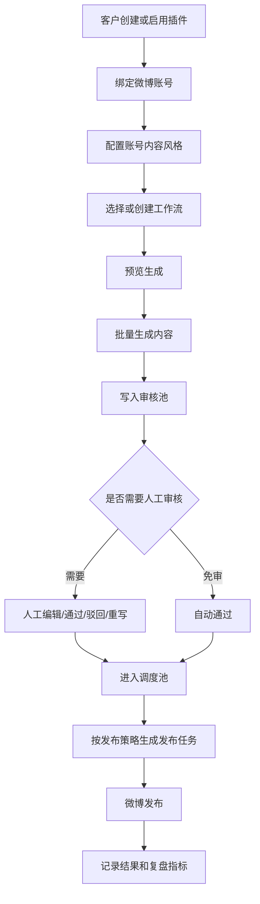

# PRD：0Worker 微博 AI 内容自动化平台

## 1. 产品定位

0Worker 不是单一客户的微博文案生成工具，而是一个面向微博内容运营客户的 AI 内容生产、审核与调度平台。

平台允许不同客户为自己的微博账号定制专属内容插件。每个插件可以包含多个内容风格、多个生成流程、多个提示词模板和多个发布策略。用户可以按需不断新增不同类型的微博内容生成器，例如热点评论、情绪价值、命理解读、产品种草、行业观点、品牌日常、活动预热等。

生成后的微博内容会进入人工审核池。客户可以选择必须审核、抽样审核或免审核。审核通过后，内容进入调度池，由系统根据账号策略安排发布时间，最终发布到对应微博账号。

## 2. 核心目标

### 2.1 业务目标

- 支持多数微博运营客户在同一套平台内完成 AI 内容生产。
- 让每个客户都能通过插件定制自己的内容风格和运营流程。
- 支持同一个微博账号下存在多种内容风格，满足矩阵化、栏目化、人格化运营。
- 将“生成文案”升级为“生成 -> 审核 -> 调度 -> 发布 -> 复盘”的完整内容流水线。
- 降低新增客户、新增微博号、新增内容风格的交付成本。

### 2.2 用户目标

- 客户可以配置自己的微博账号、内容栏目和发布节奏。
- 客户可以创建多个内容生成风格，并为每种风格配置提示词、模型、素材来源和审核规则。
- 运营人员可以批量生成微博内容，快速筛选、修改和审核。
- 审核通过的内容可以自动进入调度池，不需要人工反复复制粘贴。
- 管理员可以查看每个客户、微博号、风格和工作流的产能、成本、失败率和发布效果。

## 3. 核心概念

| 概念 | 定义 |
| --- | --- |
| 客户 Tenant | 使用平台的业务主体，例如猫小仙、品牌客户、MCN 团队。 |
| 微博账号 Account | 客户绑定的具体微博发布账号。一个客户可管理多个微博账号。 |
| 插件 Plugin | 面向某类客户或业务场景的一组内容生产能力包，包含菜单、工作流、提示词、工具和配置。 |
| 内容风格 Style | 同一微博账号下的内容表达方式或栏目，例如“治愈命理”“犀利点评”“情绪价值”“热点仿写”。 |
| 工作流 Workflow | 一条可执行的 AI 生成流程，例如抓热点、提取人物、补全资料、生成正文、生成配图、写入审核池。 |
| 生成任务 Run | 某次工作流执行实例，包含输入、状态、日志、成本和产物。 |
| 审核池 Review Pool | 存放待确认内容，支持人工编辑、通过、驳回、重写和免审策略。 |
| 调度池 Dispatch Pool | 存放已批准待发布内容，按账号发布策略排队。 |
| 发布任务 Publish Task | 面向微博账号的一次实际发布动作，包含发布时间、内容、媒体、状态和失败原因。 |

## 4. 目标用户

| 用户角色 | 诉求 |
| --- | --- |
| 客户管理员 | 配置客户插件、微博账号、内容风格、审核规则和发布策略。 |
| 内容运营 | 批量生成内容、挑选可用文案、编辑润色、审核入池。 |
| 矩阵操盘手 | 管理多个微博账号，避免内容重复，控制不同账号的发布时间和风格差异。 |
| 平台管理员 | 管理模型、工具、计费、异常任务、插件版本和客户权限。 |

## 5. 产品主流程

## 6. 功能范围

### 6.1 客户与账号管理

- 支持创建客户并绑定多个微博账号。
- 支持为每个微博账号配置基础人设、禁用词、内容长度、默认模型和发布频率。
- 支持账号级风控配置，例如每日最大发布量、最小发布间隔、夜间禁发时段。
- 支持账号状态管理：启用、暂停、只生成不发布。

### 6.2 插件与内容风格管理

- 支持客户启用一个或多个插件。
- 插件提供默认内容风格、工作流、提示词模板和页面入口。
- 同一个微博账号可绑定多个内容风格。
- 每个内容风格可配置：
  - 风格名称和用途
  - 系统提示词
  - 内容结构模板
  - 默认模型和温度参数
  - 素材来源
  - 审核策略
  - 调度策略
  - 去重策略

### 6.3 AI 内容生成

- 支持单条生成、批量生成和定时生成。
- 支持基于热点、关键词、人物、产品资料、知识库或手动输入生成微博内容。
- 支持一条工作流产出多个候选版本。
- 支持内容字段结构化输出：正文、标题、话题标签、配图建议、风险提示、素材来源。
- 支持按风格生成，不同风格之间提示词、模型、语气和输出结构可以完全不同。

### 6.4 审核池

- 支持内容进入审核池前执行基础安全检查和重复度检查。
- 支持人工编辑正文、话题、图片和发布时间建议。
- 支持通过、驳回、重新生成、局部改写。
- 支持免审策略：
  - 全部免审
  - 指定风格免审
  - 指定账号免审
  - 低风险内容免审
- 所有免审内容仍需保留日志，便于追责和回滚。

### 6.5 调度池

- 审核通过的内容进入调度池。
- 调度池按微博账号独立排队。
- 支持发布策略：
  - 手动排期
  - 固定时间段
  - 最小间隔自动排队
  - 随机离散发布时间
  - 按账号活跃时间优先发布
- 支持冲突检测：同一账号同一时间段只允许一个发布任务。
- 支持去重检测：避免同一账号或同客户矩阵账号短期发布高度相似内容。

### 6.6 微博发布

- 支持从调度池生成微博发布任务。
- 支持纯文本、图片、视频或图文混合任务。
- 发布失败时保留失败原因并支持重试。
- 对高风险客户或早期阶段，允许只进入调度池，不自动发布，由运营手动接管。

### 6.7 数据分析与运营复盘

- 统计生成量、审核通过率、调度量、发布成功率、失败原因。
- 统计不同客户、账号、风格、模型的成本和产出。
- 支持记录发布后的链接、发布时间和互动数据，作为后续优化输入。

## 7. 现有交互框架下的页面设计要求

本项目已经具备固定交互框架：左侧一级菜单 + 右侧功能区 + 顶部状态栏。后续前端设计和功能开发都必须在这个框架内完成，不新增独立导航体系，不重做应用外壳，不设计营销首页。

### 7.1 现有菜单映射

| 现有左侧菜单 | 文档中的平台能力 | 右侧功能区改造方向 |
| --- | --- | --- |
| 仪表盘 | 平台总览 | 展示生成量、待审核、待发布、失败任务、今日发布计划。 |
| AI 智能创作 | 轻量单条创作 | 保留快速文案生成能力，可作为不进入完整工作流的简化入口。 |
| Agent 引擎 | 插件、风格、工作流生成 | 承载客户插件选择、账号选择、内容风格选择、工作流运行和结果预览。 |
| 账号矩阵 | 客户微博账号管理 | 管理账号人设、发布策略、启停状态、绑定可用风格。 |
| 发布调度 | 审核池 + 调度池 + 发布记录 | 在同一右侧功能区内用 Tab 承载“待审核 / 待发布 / 发布记录”。 |
| 实时热点 | 公共素材库 | 维护热点源，供 Maoxiaoxian 等插件工作流调用。 |
| 系统设置 | 平台配置 | 配置模型、计费、安全词、默认审核策略和插件启用状态。 |

### 7.2 右侧功能区组织原则

- 每个左侧菜单对应一个主功能页，不新增同级菜单。
- 若一个菜单下有多个子能力，使用页面内 Tab、分栏或顶部筛选承载。
- 右侧功能区保持“操作区 + 列表/预览区 + 状态反馈区”的工作台结构。
- 所有新增功能必须复用现有视觉体系、按钮风格、表单风格和卡片密度。
- Agent 引擎是插件化内容生产主入口，不再新增单独“插件中心”一级页面。
- 发布调度是审核池和调度池主入口，不再新增单独“审核池”一级页面。

### 7.3 关键菜单改造要求

#### Agent 引擎

当前 Agent 引擎已有左侧配置列和右侧日志/结果区，后续应在这个页面内增强：

- 左侧配置列增加：微博账号选择、内容风格选择、生成方式选择。
- 插件卡片从硬编码猫小仙，改为读取 `ai:listPlugins`。
- 工作流从固定文案，改为读取选中插件和风格的 `workflowCode`。
- 运行时参数根据内容风格和工作流 schema 动态渲染。
- 右侧日志区继续展示实时执行链路。
- 结果区展示生成内容卡片，支持“送审”“加入调度池”“丢弃”“重新生成”。

#### 账号矩阵

- 在现有账号管理基础上增加账号 AI 配置区。
- 每个账号可配置人设、禁用表达、每日发布上限、发布时间窗口。
- 每个账号可绑定多个内容风格。
- 账号状态支持：启用、暂停、只生成不发布。

#### 发布调度

发布调度页承载三个 Tab：

| Tab | 功能 |
| --- | --- |
| 待审核 | 审核 AI 生成内容，支持编辑、通过、驳回、重写。 |
| 待发布 | 调度池列表，支持调整发布时间、立即发布、取消、退回审核。 |
| 发布记录 | 查看发布状态、失败原因、微博链接、重试入口。 |

#### 系统设置

- 增加插件启用/停用配置。
- 增加模型配置和成本配置。
- 增加安全词、风险规则和默认审核策略。
- 增加默认调度策略。

### 7.4 前端状态与空态

| 场景 | UI 表现 |
| --- | --- |
| 无微博账号 | 引导先创建或绑定账号。 |
| 无内容风格 | 引导从插件默认风格创建。 |
| 无审核内容 | 展示空态和“去生成内容”入口。 |
| 无调度内容 | 展示空态和“查看已通过内容”入口。 |
| 生成中 | 展示进度、当前节点、已生成数量和可取消按钮。 |
| 生成部分失败 | 展示成功数量、失败数量和失败原因，可重试失败项。 |
| 发布失败 | 展示失败原因、诊断信息、重试和人工接管入口。 |

## 8. 用户故事与验收口径

### 8.1 客户管理员

- 作为客户管理员，我可以为一个客户绑定多个微博账号，以便管理矩阵账号。
- 作为客户管理员，我可以给同一个微博账号创建多个内容风格，以便同一账号发布不同栏目内容。
- 作为客户管理员，我可以配置某个风格是否需要审核，以便在效率和风险之间做选择。

验收：

- 创建账号后，可以在内容生成页选择该账号。
- 创建风格后，可以在对应账号下看到该风格。
- 风格审核策略变更后，新生成内容按新策略进入审核池或调度池。

### 8.2 内容运营

- 作为内容运营，我可以选择账号和内容风格批量生成微博内容。
- 作为内容运营，我可以看到生成任务的进度和失败原因。
- 作为内容运营，我可以把满意内容送审或直接加入调度池。

验收：

- 生成任务必须产生 `runId`。
- 任务运行时可看到当前节点和日志。
- 成功生成的内容必须产生 `content_items` 记录。

### 8.3 审核人员

- 作为审核人员，我可以编辑 AI 生成内容并查看风险提示。
- 作为审核人员，我可以通过、驳回或要求 AI 重写。
- 作为审核人员，我可以把通过内容加入调度池。

验收：

- 驳回必须记录原因。
- 通过后内容状态变为 `approved`。
- 加入调度池后必须生成 `dispatch_tasks` 记录。

### 8.4 矩阵操盘手

- 作为矩阵操盘手，我可以按账号查看调度池。
- 作为矩阵操盘手，我可以调整发布时间并避免同账号发布时间冲突。
- 作为矩阵操盘手，我可以立即发布或转人工接管。

验收：

- 同一账号同一时间段不能排入两条冲突任务。
- 修改发布时间后，调度任务状态和时间同步更新。
- 立即发布必须生成发布执行记录。

## 9. 插件样例：Maoxiaoxian

Maoxiaoxian 是平台上的一个客户插件样例，服务命理/玄学/热点解读类微博账号。它不是平台的唯一目标，而是用于验证平台能否承载“强风格、强流程、强垂直工具”的客户需求。

该插件包含以下内容风格：

| 风格 | 说明 |
| --- | --- |
| 热点人物命理解读 | 从微博热点中筛选公众人物，结合生日、八字和事件生成长微博。 |
| 治愈系情绪价值 | 生成温柔、陪伴感强的国学情绪内容。 |
| 犀利热点点评 | 对热点事件生成更有观点性的微博短评。 |
| 面相/国学泛内容 | 批量生成泛玄学栏目内容。 |

## 10. 非功能要求

### 8.1 可扩展性

- 新增客户时，应优先通过新增插件配置、风格配置和工作流配置完成。
- 平台核心代码不应绑定具体客户业务逻辑。
- 客户私有逻辑必须封装在插件内部，例如命理排盘、品牌知识库、行业术语库。

### 8.2 可控性

- 所有 AI 生成结果默认可追溯到客户、账号、风格、工作流、模型和输入素材。
- 自动发布必须可关闭。
- 审核策略必须可按客户、账号和风格配置。

### 8.3 安全与合规

- 对公众人物、隐私、攻击性表达、过度预测、医疗金融法律建议等内容进行风险识别。
- 发布前保留人工编辑和拦截能力。
- 图片和外部素材需要记录来源，避免版权和肖像权风险。
- 生成内容不得绕过微博平台规则或诱导违规操作。

### 8.4 成本控制

- 支持客户级、账号级、风格级成本统计。
- 支持模型分级路由：简单提取使用低成本模型，关键创作使用高质量模型。
- 支持失败任务不重复扣费或按实际成功节点计费。

## 11. 测试验收清单

### 11.1 前端测试

- [ ] 账号为空时，生成页展示创建账号引导。
- [ ] 风格为空时，生成页展示创建风格引导。
- [ ] 切换账号后，风格列表只展示该账号可用风格。
- [ ] 审核池筛选条件可以组合使用。
- [ ] 调度池同一账号任务按时间排序。
- [ ] 长正文在审核编辑器中不溢出、不遮挡操作按钮。

### 11.2 功能测试

- [ ] 一个客户可以绑定多个微博账号。
- [ ] 一个微博账号可以配置多个内容风格。
- [ ] 每个内容风格可以绑定不同提示词、模型、审核规则和调度规则。
- [ ] 通过插件新增一种内容生成类型时，不需要修改平台核心发布与调度逻辑。
- [ ] 批量生成的内容可以进入审核池，并支持通过、驳回、编辑和重写。
- [ ] 审核通过或免审的内容可以进入调度池。
- [ ] 调度池可以按账号发布策略生成发布任务。
- [ ] 每条内容可追溯到客户、账号、插件、风格、工作流、模型和生成任务。
- [ ] 自动发布能力可以按客户、账号或风格关闭。

### 11.3 异常测试

- [ ] 任务失败时有明确状态和错误原因，不允许无限 loading。
- [ ] LLM 输出格式错误时，系统最多自动修复一次，仍失败则进入失败状态。
- [ ] 余额不足或额度不足时，不应调用模型生成。
- [ ] 发布失败时内容不丢失，可重试或人工接管。
- [ ] 高风险内容不会自动发布。

## 12. 验收标准

- [ ] 一个客户可以绑定多个微博账号。
- [ ] 一个微博账号可以配置多个内容风格。
- [ ] 每个内容风格可以绑定不同提示词、模型、审核规则和调度规则。
- [ ] 通过插件新增一种内容生成类型时，不需要修改平台核心发布与调度逻辑。
- [ ] 批量生成的内容可以进入审核池，并支持通过、驳回、编辑和重写。
- [ ] 审核通过或免审的内容可以进入调度池。
- [ ] 调度池可以按账号发布策略生成发布任务。
- [ ] 每条内容可追溯到客户、账号、插件、风格、工作流、模型和生成任务。
- [ ] 任务失败时有明确状态和错误原因，不允许无限 loading。
- [ ] 自动发布能力可以按客户、账号或风格关闭。

## 13. 分期计划

### Phase 1：平台骨架与猫小仙样板

- 客户、微博账号、插件、内容风格基础模型。
- Maoxiaoxian 插件样板。
- 单条/批量生成。
- 审核池与人工通过。
- 手动加入调度池。

### Phase 2：自动调度与发布闭环

- 调度池自动排队。
- 微博发布任务重试。
- 账号级发布频率控制。
- 内容去重和风险拦截。

### Phase 3：插件平台化

- 可视化创建内容风格。
- 工作流 DSL 配置化。
- 插件版本管理。
- 客户级报表和成本看板。

### Phase 4：智能运营优化

- 发布效果回填。
- 基于历史数据优化发布时间。
- 根据互动表现推荐内容风格和模型。
