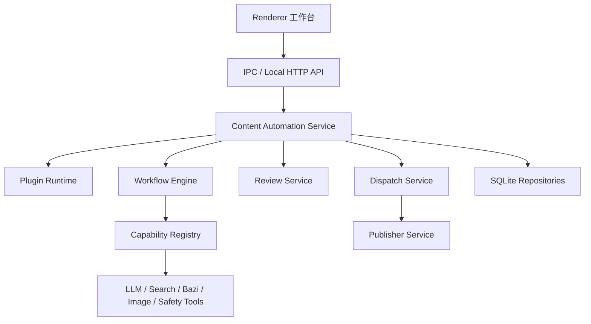
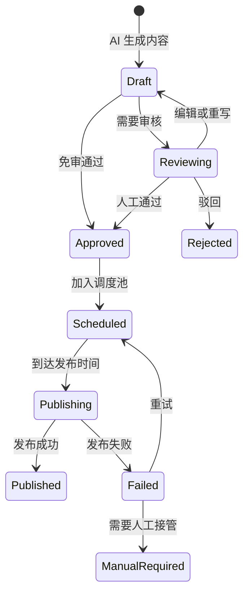

# TECH SPEC：0Worker 微博 AI 内容自动化平台架构设计

## 1. 架构目标

本架构服务于“多客户、多微博账号、多内容风格、多插件工作流”的 AI 内容生产与调度平台。

核心目标：

- 客户业务逻辑插件化，平台核心只负责通用生产、审核、调度、发布和追踪。
- 同一微博账号支持多个内容风格，每个风格可绑定独立工作流和提示词。
- AI 生成产物统一进入内容资产模型，再按审核策略进入审核池或调度池。
- 调度池与微博发布器解耦，支持人工接管、自动发布和失败重试。
- 所有生成、审核、调度、发布动作可追溯、可恢复、可统计。

## 2. 分层架构



### 2.1 Renderer 工作台

- 客户、账号、插件、内容风格配置。
- 内容生成入口。
- 审核池和调度池管理。
- 生成任务、发布任务和异常任务查看。

### 2.2 Content Automation Service

平台应用服务层，负责串联插件、工作流、审核、调度和发布。

### 2.3 Plugin Runtime

加载客户插件，读取插件元数据、风格定义、工作流定义、提示词模板和私有工具声明。

### 2.4 Workflow Engine

执行 AI 内容生成流程，处理节点依赖、上下文、重试、状态持久化和日志。

### 2.5 Review Service

管理内容审核池，处理人工通过、驳回、编辑、局部改写和免审策略。

### 2.6 Dispatch Service

管理已审核内容的排队、发布时间计算、账号频控、去重和发布任务生成。

### 2.7 Publisher Service

调用微博发布器执行发布，负责发布状态、重试和人工接管。

## 3. 核心数据模型

### 3.1 `tenants`

客户表。

| 字段 | 说明 |
| --- | --- |
| `id` | 客户 ID |
| `name` | 客户名称 |
| `status` | `active`、`paused` |
| `defaultReviewMode` | 默认审核模式 |
| `createdAt` / `updatedAt` | 时间戳 |

### 3.2 `accounts`

微博账号表，现有账号表可扩展。

| 字段 | 说明 |
| --- | --- |
| `id` | 账号 ID |
| `tenantId` | 所属客户 |
| `platform` | 固定为 `weibo`，后续可扩展 |
| `displayName` | 账号显示名 |
| `handle` | 微博昵称或标识 |
| `status` | `active`、`paused`、`generate_only` |
| `profileJson` | 账号人设、禁用词、常用话题 |
| `publishPolicyJson` | 发布频率、时间窗口、每日上限 |

### 3.3 `ai_plugins`

插件元数据。

| 字段 | 说明 |
| --- | --- |
| `code` | 插件编码，例如 `maoxiaoxian` |
| `name` | 插件名称 |
| `tenantId` | 可为空。为空表示平台公共插件 |
| `description` | 插件说明 |
| `version` | 插件版本 |
| `configJson` | 菜单、默认页面、能力声明 |

### 3.4 `content_styles`

内容风格表。它是本方案最关键的配置层，用于表达“同一个微博号可以有不同风格的内容生成”。

| 字段 | 说明 |
| --- | --- |
| `id` | 风格 ID |
| `tenantId` | 所属客户 |
| `accountId` | 绑定微博账号，可为空表示客户通用风格 |
| `pluginCode` | 所属插件 |
| `workflowCode` | 默认工作流 |
| `name` | 风格名称 |
| `description` | 风格说明 |
| `promptTemplateId` | 默认提示词模板 |
| `modelPolicyJson` | 模型、温度、最大 token、降级模型 |
| `reviewPolicyJson` | 审核规则 |
| `dispatchPolicyJson` | 调度规则 |
| `dedupePolicyJson` | 去重规则 |
| `status` | `active`、`paused` |

### 3.5 `prompt_templates`

提示词模板表。

| 字段 | 说明 |
| --- | --- |
| `id` | 模板 ID |
| `tenantId` | 所属客户 |
| `pluginCode` | 所属插件 |
| `styleId` | 关联风格 |
| `name` | 模板名称 |
| `systemPrompt` | 系统提示词 |
| `userPromptTemplate` | 用户提示词模板 |
| `outputSchemaJson` | 期望输出结构 |
| `version` | 模板版本 |

### 3.6 `ai_workflows`

工作流定义表。

| 字段 | 说明 |
| --- | --- |
| `pluginCode` | 所属插件 |
| `code` | 工作流编码 |
| `name` | 工作流名称 |
| `version` | 工作流版本 |
| `definitionJson` | 工作流 DSL |
| `status` | `active`、`deprecated` |

### 3.7 `ai_workflow_runs`

工作流执行实例。

| 字段 | 说明 |
| --- | --- |
| `runId` | 唯一执行 ID |
| `tenantId` | 客户 ID |
| `accountId` | 微博账号 ID |
| `pluginCode` | 插件编码 |
| `styleId` | 内容风格 ID |
| `workflowCode` | 工作流编码 |
| `status` | `queued`、`running`、`partial_success`、`failed`、`completed`、`cancelled` |
| `inputJson` | 输入参数 |
| `contextSnapshot` | 上下文快照 |
| `costJson` | token 和费用 |
| `logs` | 执行日志 |
| `startedAt` / `finishedAt` | 时间戳 |

### 3.8 `content_items`

内容资产表。AI 生成结果先成为内容资产，而不是直接发布。

| 字段 | 说明 |
| --- | --- |
| `id` | 内容 ID |
| `tenantId` | 客户 ID |
| `accountId` | 微博账号 ID |
| `pluginCode` | 插件编码 |
| `styleId` | 内容风格 ID |
| `runId` | 来源生成任务 |
| `title` | 内部标题 |
| `body` | 微博正文 |
| `topicsJson` | 话题标签 |
| `mediaJson` | 图片/视频资源 |
| `sourceJson` | 热点、人物、知识库等来源 |
| `riskJson` | 风险识别结果 |
| `status` | `draft`、`reviewing`、`approved`、`rejected`、`scheduled`、`published`、`failed` |
| `createdAt` / `updatedAt` | 时间戳 |

### 3.9 `review_items`

审核池表。

| 字段 | 说明 |
| --- | --- |
| `id` | 审核记录 ID |
| `contentId` | 内容 ID |
| `reviewMode` | `manual`、`auto`、`sample` |
| `status` | `pending`、`approved`、`rejected`、`rewriting` |
| `reviewerId` | 审核人 |
| `comment` | 审核意见 |
| `approvedAt` | 通过时间 |

### 3.10 `dispatch_tasks`

调度池表。

| 字段 | 说明 |
| --- | --- |
| `id` | 调度任务 ID |
| `contentId` | 内容 ID |
| `tenantId` | 客户 ID |
| `accountId` | 微博账号 ID |
| `scheduledAt` | 计划发布时间 |
| `priority` | 优先级 |
| `status` | `queued`、`locked`、`publishing`、`published`、`failed`、`cancelled` |
| `policySnapshotJson` | 入池时的调度策略快照 |
| `lastError` | 最近失败原因 |

### 3.11 `publish_runs`

发布执行记录。

| 字段 | 说明 |
| --- | --- |
| `id` | 发布执行 ID |
| `dispatchTaskId` | 调度任务 ID |
| `accountId` | 微博账号 ID |
| `status` | `running`、`published`、`failed`、`manual_required` |
| `publishedUrl` | 微博链接 |
| `diagnosticsJson` | 浏览器、选择器、截图、错误信息 |
| `startedAt` / `finishedAt` | 时间戳 |

## 4. 前端模块与组件契约

### 4.1 现有菜单模块映射

本项目已有 `src/renderer/App.tsx` 中定义的左侧菜单和右侧功能区。后续实现必须在这些现有页面内扩展，不新增新的一级导航壳。

| 现有页面组件 | 菜单名称 | 新增/承载能力 | 依赖接口 | 主要状态 |
| --- | --- | --- | --- |
| `HomePage` | 仪表盘 | AI 生产和发布概览 | `dashboard:getSummary` | 加载中、正常、失败 |
| `AiWriterPage` | AI 智能创作 | 快速单条生成，不承担完整插件工作流 | 现有 AI 生成接口 | 待输入、生成中、成功、失败 |
| `AgentEnginePage` | Agent 引擎 | 插件选择、账号选择、风格选择、工作流运行、结果预览 | `ai:listPlugins`、`ai:listStyles`、`ai:startWorkflowRun`、`ai:getWorkflowRun` | 待输入、运行中、部分成功、成功、失败 |
| `AccountsPage` | 账号矩阵 | 账号人设、发布策略、绑定风格 | `accounts:list`、`accounts:updatePolicy`、`ai:listStyles` | 空账号、编辑中、保存中 |
| `QueuePage` | 发布调度 | 待审核、待发布、发布记录三个 Tab | `review:*`、`dispatch:*`、`publish:*` | 空列表、审核中、排期中、发布中 |
| `HotTopicsPage` | 实时热点 | 热点素材库，供工作流调用 | 热点列表/刷新接口 | 加载中、空热点、刷新中 |
| `SettingsPage` | 系统设置 | 插件、模型、计费、安全、默认审核策略 | `ai:listPlugins`、设置接口 | 加载中、保存中 |

### 4.2 核心组件

| 组件 | 职责 | 输入 | 输出 |
| --- | --- | --- | --- |
| `AccountSelector` | 选择微博账号 | `tenantId` | `accountId` |
| `StyleSelector` | 选择内容风格 | `accountId`、`pluginCode` | `styleId` |
| `StyleEditor` | 编辑风格配置 | `contentStyle` | `modelPolicyJson`、`reviewPolicyJson`、`dispatchPolicyJson` |
| `WorkflowRunPanel` | 展示运行进度 | `runId` | 取消、重试失败项 |
| `ContentEditor` | 编辑微博正文和话题 | `contentItem` | 更新后的正文、话题、媒体 |
| `RiskBadgeList` | 展示风险标签 | `riskJson` | 无 |
| `ReviewActions` | 审核操作 | `reviewItem` | 通过、驳回、重写 |
| `DispatchCalendar` | 调度日历 | `dispatchTasks` | 调整排期、立即发布 |

这些组件应优先放在 `src/renderer/components` 或对应页面局部组件中，由现有页面组合使用。不要为这些能力重新创建独立应用外壳。

### 4.3 前端数据刷新策略

- 列表页初次进入必须加载远端数据。
- 生成任务运行中，每 2 秒轮询一次 `ai:getWorkflowRun`，完成或失败后停止。
- 审核池和调度池操作成功后，应局部刷新当前记录并更新列表统计。
- 发布中任务每 3 秒轮询一次发布状态，最多持续 5 分钟，超时后显示人工刷新入口。

### 4.4 对现有 `AgentEnginePage` 的改造要求

当前 `AgentEnginePage` 已有插件卡、运行时参数、实时日志和结果预览。下一步开发应在此基础上迭代：

- 将猫小仙插件卡从硬编码改为 `plugins` 列表渲染。
- 增加账号选择，数据来自 `appApi.accounts.list()`。
- 增加内容风格选择，数据来自 `ai:listStyles(accountId)`。
- 运行参数不再固定为 `userBirth/persona/tone`，应根据选中工作流的 `inputSchema` 或风格配置渲染。
- `立即预览运行` 保留，用于 `previewWorkflow`。
- 新增 `正式生成`，调用 `ai:startWorkflowRun` 并创建可追踪内容资产。
- 结果预览区增加：送审、加入调度池、丢弃、重新生成。

### 4.5 对现有 `QueuePage` 的改造要求

当前发布调度页应成为审核和调度主页面：

- 顶部增加 Tab：`待审核`、`待发布`、`发布记录`。
- `待审核` Tab 调用 `review:listItems`。
- `待发布` Tab 调用 `dispatch:listTasks`。
- `发布记录` Tab 调用 `publish:listRuns`。
- 保留现有发布队列能力，并扩展内容来源为 AI 生成内容资产。

## 5. 插件目录结构

```text
src/main/plugins/
└── maoxiaoxian/
    ├── plugin.json
    ├── styles/
    │   ├── hot-bazi.json
    │   ├── healing-emotion.json
    │   └── sharp-commentary.json
    ├── workflows/
    │   ├── daily-hot-person.json
    │   ├── manual-topic.json
    │   └── batch-emotion.json
    ├── prompts/
    │   ├── hot-bazi.system.md
    │   └── healing-emotion.system.md
    └── tools/
        └── bazi-tool.ts
```

插件可以声明：

- 默认内容风格。
- 可用工作流。
- 私有工具。
- 默认提示词模板。
- 菜单入口和配置页面。

## 6. 工作流 DSL

### 5.1 定义示例

```json
{
  "version": "1.0",
  "workflowId": "maoxiaoxian.daily_hot_person",
  "name": "热点人物命理解读",
  "inputSchema": {
    "type": "object",
    "required": ["date", "styleId", "accountId"]
  },
  "steps": [
    {
      "id": "fetch_hot_events",
      "type": "tool",
      "tool": "tophub.fetch",
      "timeoutMs": 30000,
      "retry": { "maxAttempts": 2, "backoffMs": 3000 },
      "outputKey": "hotEvents"
    },
    {
      "id": "extract_people",
      "type": "llm",
      "dependsOn": ["fetch_hot_events"],
      "promptTemplate": "maoxiaoxian.extract_people",
      "input": { "events": "{{hotEvents}}" },
      "outputKey": "people"
    },
    {
      "id": "batch_generate",
      "type": "batch",
      "dependsOn": ["extract_people"],
      "sourceKey": "people",
      "concurrency": 3,
      "steps": [
        {
          "id": "bazi",
          "type": "tool",
          "tool": "maoxiaoxian.bazi",
          "outputKey": "bazi"
        },
        {
          "id": "generate_weibo",
          "type": "llm",
          "promptTemplate": "{{style.promptTemplateId}}",
          "outputKey": "contentDraft"
        },
        {
          "id": "safety_check",
          "type": "safety_check",
          "inputKey": "contentDraft",
          "outputKey": "risk"
        },
        {
          "id": "create_content_item",
          "type": "persist_content",
          "reviewTarget": "review_pool"
        }
      ]
    }
  ]
}
```

### 5.2 节点通用字段

| 字段 | 说明 |
| --- | --- |
| `id` | 节点唯一 ID |
| `type` | `llm`、`tool`、`batch`、`safety_check`、`persist_content` |
| `dependsOn` | 前置节点 |
| `timeoutMs` | 超时 |
| `retry` | 重试策略 |
| `input` | 输入映射 |
| `outputKey` | 输出写入上下文的位置 |
| `onFailure` | `fail_workflow`、`skip_item`、`fallback`、`manual_required` |

## 7. 内容生成到调度池的状态机



## 8. 审核策略

`reviewPolicyJson` 示例：

```json
{
  "mode": "manual",
  "autoApproveWhenRiskBelow": 20,
  "requireManualFor": ["public_figure", "sensitive_topic", "high_similarity"],
  "allowInlineRewrite": true
}
```

审核服务处理流程：

1. 读取内容风格的审核策略。
2. 执行安全检测和重复度检测。
3. 如果命中强制人工规则，写入审核池。
4. 如果允许免审且风险分低于阈值，自动批准。
5. 审核通过后调用 Dispatch Service 入调度池。

## 9. 调度策略

`dispatchPolicyJson` 示例：

```json
{
  "mode": "smart_interval",
  "dailyLimit": 8,
  "minIntervalMinutes": 45,
  "timeWindows": [
    { "start": "09:00", "end": "11:30" },
    { "start": "18:00", "end": "22:30" }
  ],
  "randomJitterMinutes": 12,
  "avoidSimilarContentHours": 24
}
```

调度服务必须保证：

- 同一账号不突破每日发布上限。
- 同一账号相邻发布不小于最小间隔。
- 同一客户矩阵账号短期内避免高度重复。
- 已排期内容可人工调整发布时间。
- 发布失败不会丢失内容。

## 10. API 契约

所有 IPC / Local HTTP API 返回统一结构：

```typescript
type ApiResult<T> = {
  ok: boolean;
  data?: T;
  error?: {
    code: string;
    message: string;
    detail?: unknown;
  };
};
```

### 10.1 `ai:listStyles(accountId)`

请求：

```json
{ "accountId": "acc_001" }
```

响应：

```json
{
  "ok": true,
  "data": [
    {
      "id": "style_hot_bazi",
      "accountId": "acc_001",
      "pluginCode": "maoxiaoxian",
      "workflowCode": "maoxiaoxian.daily_hot_person",
      "name": "热点人物命理解读",
      "status": "active"
    }
  ]
}
```

### 10.2 `ai:startWorkflowRun`

请求：

```json
{
  "tenantId": "tenant_001",
  "accountId": "acc_001",
  "pluginCode": "maoxiaoxian",
  "styleId": "style_hot_bazi",
  "workflowCode": "maoxiaoxian.daily_hot_person",
  "input": {
    "date": "2026-05-04",
    "count": 10,
    "refreshHotEvents": true
  }
}
```

响应：

```json
{
  "ok": true,
  "data": {
    "runId": "run_001",
    "status": "queued"
  }
}
```

### 10.3 `ai:getWorkflowRun`

响应：

```json
{
  "ok": true,
  "data": {
    "runId": "run_001",
    "status": "running",
    "progress": {
      "currentStep": "generate_weibo",
      "completedItems": 4,
      "totalItems": 10
    },
    "logs": [],
    "createdContentIds": ["content_001", "content_002"]
  }
}
```

### 10.4 `review:approve`

请求：

```json
{
  "reviewItemId": "review_001",
  "schedule": {
    "mode": "auto"
  }
}
```

响应：

```json
{
  "ok": true,
  "data": {
    "contentId": "content_001",
    "contentStatus": "approved",
    "dispatchTaskId": "dispatch_001"
  }
}
```

### 10.5 `dispatch:schedule`

请求：

```json
{
  "contentId": "content_001",
  "accountId": "acc_001",
  "scheduledAt": "2026-05-04T20:30:00+08:00"
}
```

响应：

```json
{
  "ok": true,
  "data": {
    "dispatchTaskId": "dispatch_001",
    "status": "queued",
    "scheduledAt": "2026-05-04T20:30:00+08:00"
  }
}
```

### 10.6 错误码

| 错误码 | 说明 | 前端处理 |
| --- | --- | --- |
| `VALIDATION_ERROR` | 请求参数不合法 | 高亮表单错误 |
| `ACCOUNT_NOT_FOUND` | 账号不存在 | 刷新账号列表 |
| `STYLE_NOT_FOUND` | 风格不存在或停用 | 提示重新选择风格 |
| `WORKFLOW_NOT_FOUND` | 工作流不存在 | 提示插件配置异常 |
| `QUOTA_NOT_ENOUGH` | 额度不足 | 引导充值或降低生成数量 |
| `MODEL_UNAVAILABLE` | 模型不可用 | 提示切换模型或稍后重试 |
| `RISK_BLOCKED` | 内容风险过高 | 强制进入人工审核 |
| `SCHEDULE_CONFLICT` | 发布时间冲突 | 提示选择其他时间 |
| `PUBLISH_FAILED` | 发布失败 | 展示重试和人工接管 |

## 11. 幂等、计费与失败处理

### 9.1 幂等键

所有关键动作必须带幂等键：

| 动作 | 幂等键 |
| --- | --- |
| 工作流执行 | `runId` |
| 单条内容生成 | `runId + stepId + itemKey` |
| 内容入审核池 | `contentId` |
| 内容入调度池 | `contentId + accountId` |
| 发布任务 | `dispatchTaskId` |
| 扣费 | `runId + billableNodeId` |

### 9.2 计费

- 生成前检查客户或用户余额。
- LLM 节点完成后记录 token 和成本。
- 批量任务按成功内容或成功节点计费。
- 失败重试不应重复扣除同一幂等节点费用。
- 每条内容保留成本快照，支持按客户、账号、风格统计。

### 9.3 失败处理

- 节点失败可按配置重试。
- 单条批处理失败不应导致整批全部失败，除非工作流配置为强一致。
- 调度发布失败进入 `failed`，可重试或转人工接管。
- 所有失败必须写入 `lastError` 和结构化日志。

## 12. 安全与合规

安全检测至少包括：

- 敏感词和平台风控词。
- 公众人物隐私与不可证实结论。
- 诽谤、攻击、侮辱、造谣风险。
- 玄学/预测类绝对化表达。
- 重复内容和洗稿风险。
- 图片版权和来源缺失风险。

高风险内容默认进入人工审核，不允许自动发布。

## 13. IPC / API 清单

| 接口 | 说明 |
| --- | --- |
| `ai:listPlugins` | 获取插件列表 |
| `ai:listStyles(accountId)` | 获取账号可用内容风格 |
| `ai:createStyle` | 创建内容风格 |
| `ai:updateStyle` | 更新内容风格配置 |
| `ai:previewWorkflow` | 预览执行工作流 |
| `ai:startWorkflowRun` | 正式执行生成任务 |
| `ai:getWorkflowRun` | 查询任务状态 |
| `review:listItems` | 获取审核池 |
| `review:approve` | 审核通过 |
| `review:reject` | 驳回 |
| `review:rewrite` | 局部或整体重写 |
| `dispatch:listTasks` | 获取调度池 |
| `dispatch:schedule` | 加入或调整排期 |
| `dispatch:cancel` | 取消调度 |
| `publish:runNow` | 立即发布 |

## 14. 测试策略

### 14.1 单元测试

- Workflow DSL 校验：缺少必填字段、非法节点类型、循环依赖。
- Review Service：不同审核策略下的入池和自动通过逻辑。
- Dispatch Service：时间窗口、最小间隔、每日上限、冲突检测。
- 幂等逻辑：重复调用不重复创建内容、审核记录、调度任务和扣费记录。

### 14.2 集成测试

- `startWorkflowRun -> content_items -> review_items` 主链路。
- `review:approve -> dispatch_tasks` 审核入调度池链路。
- `dispatch:schedule -> publish:runNow -> publish_runs` 发布链路。
- LLM 失败、重试、部分成功场景。

### 14.3 前端测试

- 生成页账号/插件/风格联动。
- 工作流运行中进度展示和轮询停止。
- 审核池编辑保存、通过、驳回、重写。
- 调度池时间冲突提示。
- 发布失败后的重试和人工接管入口。

### 14.4 端到端验收场景

1. 创建客户和微博账号。
2. 启用 Maoxiaoxian 插件。
3. 创建两个内容风格并绑定同一微博账号。
4. 使用热点人物命理解读生成 5 条内容。
5. 其中 3 条进入审核池，2 条因低风险自动进入调度池。
6. 审核通过 1 条并加入调度池。
7. 调整调度时间。
8. 立即发布一条，记录发布结果。

## 15. 分期实现

### Phase 1

- 扩展客户、账号、插件、内容风格数据模型。
- Maoxiaoxian 插件落地。
- 工作流生成内容并写入审核池。
- 人工审核后加入调度池。

### Phase 2

- 调度池自动排期。
- 微博发布任务接入现有 Publisher。
- 发布失败重试和人工接管。
- 风险检测和重复度检测。

### Phase 3

- 可视化内容风格配置。
- 工作流 DSL 校验和版本管理。
- 客户级成本看板。
- 发布效果回填。
