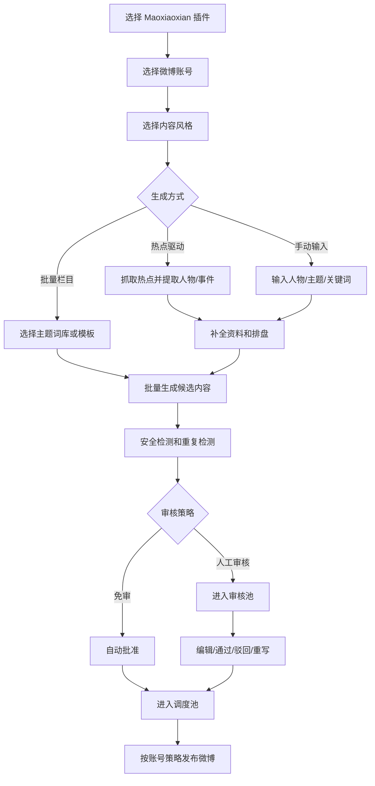

# PRD：Maoxiaoxian 微博 AI 内容插件方案

## 1. 插件定位

Maoxiaoxian 是 0Worker 微博 AI 内容自动化平台中的一个客户插件样例。它服务命理、国学、情绪价值和热点人物解读类微博账号，用来验证平台是否可以支持高度定制化的客户内容生产流程。

该插件不是独立应用，而是运行在平台的客户、微博账号、内容风格、审核池和调度池体系之上。

## 2. 客户需求概述

Maoxiaoxian 希望围绕微博热点人物、公众事件、命理八字、国学表达和情绪陪伴，持续生产适合微博发布的内容。

同一个微博账号下可能同时存在多种内容风格：

- 热点人物命理解读。
- 治愈系情绪价值。
- 犀利热点点评。
- 国学/面相泛内容。
- 节气、星座、转运类栏目。

每种风格都需要独立的提示词、生成逻辑、内容结构、审核策略和发布节奏。

## 3. 目标用户

| 用户 | 诉求 |
| --- | --- |
| Maoxiaoxian 客户管理员 | 配置微博账号、内容风格、模型、提示词和审核规则。 |
| 内容运营 | 批量生成热点内容，挑选和编辑可发布文案。 |
| 审核人员 | 检查公众人物事实、风险表达和微博语气。 |
| 矩阵操盘手 | 将不同风格内容加入调度池，控制账号发布节奏。 |

## 4. 内容风格设计

### 4.1 热点人物命理解读

| 配置项 | 内容 |
| --- | --- |
| 风格目标 | 借助微博热点人物和事件，生成带命理视角的长微博。 |
| 素材来源 | TopHub/微博热搜、人物公开资料、生日信息、八字排盘。 |
| 输出结构 | 开头钩子、热点回顾、命理解读、情绪价值、互动提问。 |
| 审核策略 | 默认人工审核。公众人物、生日不确定、婚恋/健康/灾祸表达必须人工确认。 |
| 调度策略 | 每日 1-3 条，优先热点高峰时段。 |

### 4.2 治愈系情绪价值

| 配置项 | 内容 |
| --- | --- |
| 风格目标 | 生成温柔、陪伴、安慰感强的微博内容。 |
| 素材来源 | 国学句式、节气、情绪主题、用户输入关键词。 |
| 输出结构 | 共情开头、国学隐喻、情绪安抚、行动建议。 |
| 审核策略 | 低风险内容可免审，高敏词命中进入人工审核。 |
| 调度策略 | 每日多条，适合早晚固定时段。 |

### 4.3 犀利热点点评

| 配置项 | 内容 |
| --- | --- |
| 风格目标 | 对热点事件生成更有观点、更有传播力的短评。 |
| 素材来源 | 热搜标题、事件摘要、评论区关键词。 |
| 输出结构 | 判断句、反差观点、解释、互动话题。 |
| 审核策略 | 必须人工审核，避免攻击、诽谤、站队过强。 |
| 调度策略 | 只在热点有效期内发布。 |

### 4.4 国学/面相泛内容

| 配置项 | 内容 |
| --- | --- |
| 风格目标 | 批量生成泛国学、面相、转运类日常内容。 |
| 素材来源 | 主题词库、节气、传统文化素材库。 |
| 输出结构 | 观点句、解释、提醒、互动引导。 |
| 审核策略 | 可配置抽样审核。 |
| 调度策略 | 作为账号日常内容填充调度池。 |

## 5. 插件主流程



## 6. 功能需求

### 6.1 插件启用

- 平台管理员或客户管理员可以为客户启用 Maoxiaoxian 插件。
- 插件启用后自动提供默认内容风格和工作流。
- 客户可以复制默认风格并创建自己的变体。

### 6.2 微博账号绑定

- 客户可以将一个或多个微博账号绑定到 Maoxiaoxian 插件。
- 每个账号可以选择启用哪些内容风格。
- 每个账号可以配置：
  - 默认人设。
  - 禁用表达。
  - 每日发布上限。
  - 发布时间窗口。
  - 是否允许免审。

### 6.3 内容风格配置

每个内容风格支持以下配置：

| 配置 | 说明 |
| --- | --- |
| 风格名称 | 运营可识别的栏目名。 |
| 系统提示词 | 控制人设、语气、禁区和内容结构。 |
| 生成模板 | 控制输出字段，例如正文、话题、配图建议、风险备注。 |
| 默认模型 | 可按风格选择不同模型。 |
| 素材来源 | 热点、手动输入、主题词库、人物资料库。 |
| 审核策略 | 人工审核、免审、抽样审核。 |
| 调度策略 | 每日数量、时间窗口、最小间隔。 |

### 6.4 热点人物命理解读生成

#### 输入

- 日期。
- 微博账号。
- 内容风格。
- 热点来源。
- 是否强制刷新。
- 生成数量。

#### 流程

1. 抓取热点事件。
2. 识别适合创作的公众人物或事件。
3. 补全人物资料、生日和公开来源。
4. 对生日可信度打分。
5. 生成八字/三柱/大运摘要。
6. 按内容风格生成微博正文。
7. 生成话题标签和配图建议。
8. 执行安全和重复检测。
9. 写入审核池或自动进入调度池。

#### 输出字段

| 字段 | 说明 |
| --- | --- |
| `body` | 微博正文 |
| `topics` | 话题标签 |
| `personName` | 人物姓名 |
| `eventSummary` | 热点事件摘要 |
| `birthday` | 生日 |
| `birthdayConfidence` | 生日可信度 |
| `baziSummary` | 命理解读摘要 |
| `sourceUrls` | 资料来源 |
| `riskFlags` | 风险标签 |
| `styleId` | 内容风格 |

### 6.5 手动输入生成

- 用户可以输入人物、事件、关键词或完整主题。
- 系统根据当前风格决定是否需要补全人物资料和排盘。
- 生成内容同样进入审核或调度流程。

### 6.6 批量栏目生成

- 支持选择主题词库批量生成内容。
- 支持一次生成多个候选版本。
- 支持自动过滤重复、过短、风险过高的内容。
- 支持将合格内容批量送审。

### 6.7 审核池能力

Maoxiaoxian 的审核池需要重点支持：

- 人工核验公众人物资料。
- 修改正文和话题。
- 局部改写，例如“更温柔”“更犀利”“减少玄学判断”。
- 驳回并记录原因。
- 一键通过并加入调度池。

### 6.8 调度池能力

- 按微博账号独立排期。
- 支持手动调整发布时间。
- 支持同一账号多风格混排。
- 支持限制同一风格连续发布，避免账号内容单调。
- 支持发布前再次检测高风险内容。

## 7. 现有交互框架下的前端设计要求

Maoxiaoxian 不新增独立应用入口。它作为插件能力，主要呈现在现有左侧菜单的 `Agent 引擎`、`发布调度`、`账号矩阵`、`实时热点` 和 `系统设置` 中。

### 7.1 Agent 引擎中的 Maoxiaoxian 区域

目标：让运营人员在现有 Agent 引擎页面中快速选择账号、Maoxiaoxian 插件、内容风格和生成方式。

页面区域：

| 区域 | 功能 |
| --- | --- |
| 账号选择 | 选择当前微博账号，展示账号状态和今日发布额度。 |
| 风格选择 | 展示 4 个默认风格和客户自定义风格。 |
| 生成方式 | 热点驱动、手动输入、批量栏目。 |
| 参数面板 | 生成数量、模型、是否刷新热点、是否自动送审。 |
| 任务面板 | 当前 runId、进度、成功数量、失败数量、日志。 |
| 结果预览 | 展示生成内容摘要，可送审或丢弃。 |

### 7.2 账号矩阵中的 Maoxiaoxian 配置

在现有 `账号矩阵` 页面中，每个微博账号应能配置 Maoxiaoxian 相关能力：

- 是否启用 Maoxiaoxian 插件。
- 启用哪些 Maoxiaoxian 内容风格。
- 账号级人设和禁用表达。
- 各风格每日发布上限。
- 是否允许低风险内容免审。

### 7.3 系统设置中的风格配置

页面字段：

- 风格名称。
- 绑定微博账号。
- 工作流。
- 系统提示词。
- 输出结构说明。
- 模型参数。
- 审核策略。
- 调度策略。
- 禁用表达。

必须提供“从默认风格复制”能力，避免客户从零配置。

### 7.4 Agent 引擎中的热点人物生成模式

输入控件：

- 日期选择。
- 热点来源选择。
- 生成数量。
- 是否强制刷新热点。
- 人物过滤规则，例如明星、企业家、运动员、公众人物。

结果列表字段：

- 人物姓名。
- 热点事件。
- 生日可信度。
- 风险等级。
- 正文摘要。
- 状态：待审核、已入调度池、已驳回、失败。

### 7.5 发布调度中的审核详情

重点展示：

- 微博正文编辑器。
- 话题标签。
- 公众人物资料来源。
- 生日可信度。
- 八字摘要。
- 风险标签。
- 相似内容提示。

操作：

- 通过并自动排期。
- 通过但手动选择发布时间。
- 驳回。
- 局部重写。
- 降低玄学判断强度。

### 7.6 实时热点中的素材支持

Maoxiaoxian 的热点人物命理解读依赖实时热点页提供的素材能力：

- 刷新微博/全网热点。
- 查看热点来源和热度。
- 标记某条热点是否适合 Maoxiaoxian 生成。
- 将热点作为 Agent 引擎生成输入。

## 8. Maoxiaoxian 默认配置

### 8.1 默认内容风格配置

```json
[
  {
    "id": "mx_hot_bazi",
    "name": "热点人物命理解读",
    "workflowCode": "maoxiaoxian.daily_hot_person",
    "reviewPolicy": { "mode": "manual" },
    "dispatchPolicy": { "dailyLimit": 3, "minIntervalMinutes": 90 }
  },
  {
    "id": "mx_healing_emotion",
    "name": "治愈系情绪价值",
    "workflowCode": "maoxiaoxian.manual_or_batch_topic",
    "reviewPolicy": { "mode": "auto", "autoApproveWhenRiskBelow": 20 },
    "dispatchPolicy": { "dailyLimit": 6, "minIntervalMinutes": 45 }
  },
  {
    "id": "mx_sharp_commentary",
    "name": "犀利热点点评",
    "workflowCode": "maoxiaoxian.hot_commentary",
    "reviewPolicy": { "mode": "manual" },
    "dispatchPolicy": { "dailyLimit": 2, "minIntervalMinutes": 120 }
  },
  {
    "id": "mx_guoxue_daily",
    "name": "国学/面相泛内容",
    "workflowCode": "maoxiaoxian.batch_guoxue",
    "reviewPolicy": { "mode": "sample", "sampleRate": 0.3 },
    "dispatchPolicy": { "dailyLimit": 8, "minIntervalMinutes": 40 }
  }
]
```

### 8.2 默认输出 Schema

```json
{
  "body": "微博正文",
  "topics": ["话题1", "话题2"],
  "summary": "内部摘要",
  "mediaSuggestion": "配图建议",
  "riskNotes": ["风险说明"],
  "source": {
    "hotEventUrl": "热点来源",
    "personSourceUrls": ["人物资料来源"]
  }
}
```

## 9. 数据设计补充

Maoxiaoxian 插件需要在平台通用表基础上补充业务字段，建议写入 `content_items.sourceJson` 或插件私有扩展表。

```json
{
  "person": {
    "name": "某公众人物",
    "birthday": "1990-01-01",
    "birthdayConfidence": 0.72,
    "sourceUrls": ["https://example.com"]
  },
  "hotEvent": {
    "title": "热点标题",
    "source": "weibo",
    "heatValue": 123456
  },
  "bazi": {
    "sizhu": "三柱结果",
    "dayun": "大运摘要",
    "summary": "用于创作的命理摘要"
  }
}
```

## 10. 风险与合规

Maoxiaoxian 属于高风格化内容插件，必须对以下风险做强约束：

- 不把 AI 推测的人物生日包装成确定事实。
- 不输出对公众人物健康、婚恋、灾祸、死亡、违法等确定性预测。
- 不制造诽谤、攻击、侮辱或隐私泄露。
- 不使用无来源图片直接商用。
- 玄学内容必须保持娱乐化、观点化和非确定性表达。
- 热点点评类内容默认人工审核。

## 11. 测试用例

### 11.1 生成测试

- [ ] 热点人物命理解读生成时，必须生成人物名、事件摘要、正文和风险标签。
- [ ] 生日可信度低于阈值时，内容必须进入人工审核。
- [ ] 手动输入主题可以按当前风格生成内容。
- [ ] 批量栏目生成时，单条失败不影响其他条目生成。

### 11.2 审核测试

- [ ] 热点人物命理解读默认进入人工审核。
- [ ] 治愈系低风险内容可以自动通过。
- [ ] 犀利热点点评无论风险分数多少都必须人工审核。
- [ ] 局部重写后正文更新，但来源和风险记录保留。

### 11.3 调度测试

- [ ] 同一微博账号可混排不同 Maoxiaoxian 风格内容。
- [ ] 同一风格连续发布超过限制时，系统提示调整。
- [ ] 调度时间冲突时不能保存。
- [ ] 高风险内容不能进入自动发布。

### 11.4 UI 测试

- [ ] 插件首页切换账号后，风格列表随账号变化。
- [ ] 热点人物结果列表展示生日可信度和风险等级。
- [ ] 审核详情页可以查看来源链接。
- [ ] 长微博正文在编辑器中可以完整编辑。

## 12. 验收标准

- [ ] 客户可以启用 Maoxiaoxian 插件。
- [ ] 一个微博账号可以同时启用多个 Maoxiaoxian 内容风格。
- [ ] 每个风格可以配置独立提示词、模型、审核策略和调度策略。
- [ ] 热点人物命理解读可以从热点生成内容资产。
- [ ] 手动输入主题可以按当前风格生成内容资产。
- [ ] 生成内容可以进入审核池，并支持编辑、重写、通过和驳回。
- [ ] 审核通过或免审内容可以进入调度池。
- [ ] 调度池可以混排同一账号下不同风格的内容。
- [ ] 公众人物生日可信度和来源可以被记录。
- [ ] 高风险内容不会自动发布。

## 13. 默认交付范围

### Phase 1

- Maoxiaoxian 插件启用。
- 4 个默认内容风格。
- 热点人物命理解读工作流。
- 手动输入生成工作流。
- 审核池接入。
- 人工加入调度池。

### Phase 2

- 批量栏目生成。
- 调度池自动排期。
- 发布结果回填。
- 重复度检测。

### Phase 3

- 风格效果统计。
- 根据互动数据推荐内容风格。
- 自动优化提示词和发布时间。
