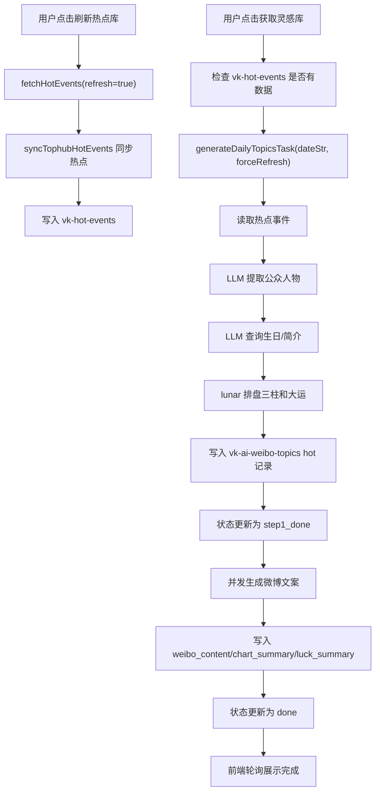
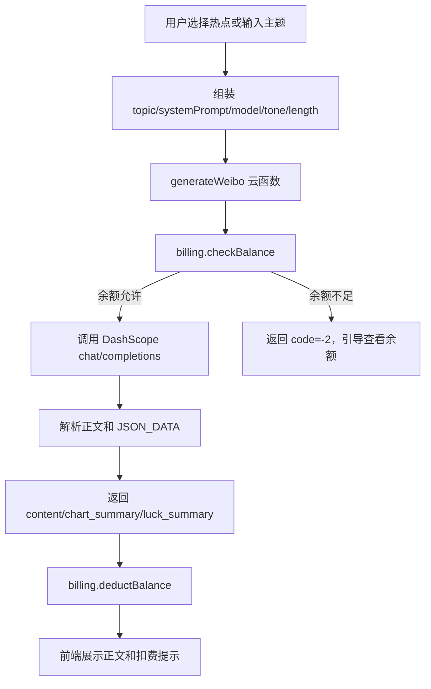
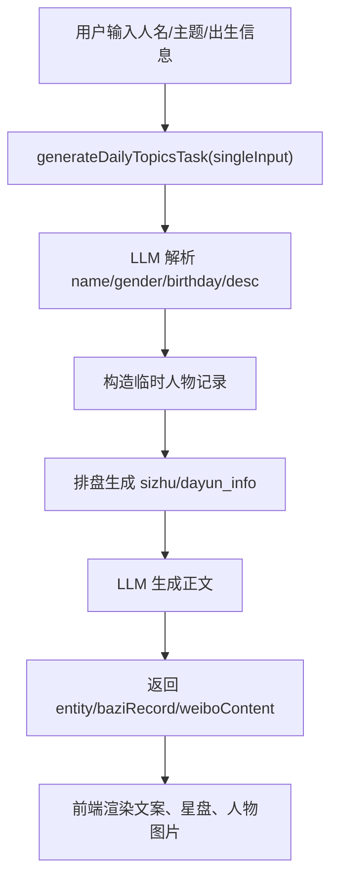

# PRD：Maoxiaoxian AI 微博内容生成模块

## 1. 文档信息

| 项目 | 内容 |
| --- | --- |
| 产品名称 | Maoxiaoxian AI 微博内容生成模块 |
| 所属项目 | com-0worker-app |
| 文档类型 | 产品需求文档 PRD |
| 当前版本 | v1.0 |
| 编写日期 | 2026-05-03 |
| 参考代码目录 | `pages/modules/custom/maoxiaoxian`、`uniCloud-aliyun/cloudfunctions/router/service/client/ai` |

## 2. 产品概述

Maoxiaoxian 是项目中的 AI 内容生产模块，核心目标是帮助运营者围绕微博热点人物、公众人物、命理八字和国学玄学视角，快速生成可直接发布到微博的长文案。

模块包含三条主要能力链路：

1. 热点驱动生成：从热点库中筛选公众人物，补全生日、生平、八字三柱、大运信息，并预生成微博文案。
2. 手工输入生成：用户输入人物名、事件或测算背景，系统自动解析人物信息并生成文案。
3. 文案分发辅助：支持复制文案、搜索人物图片、唤起微博发布页。

此外，模块还包含系统提示词配置、AI 模型选择、语气/篇幅参数、八字可视化、批量情绪文案、面相文案、热点仿写等周边能力。

## 3. 产品目标

### 3.1 业务目标

- 降低微博运营人员从找热点、查人物、组织命理角度到写成长文案的时间成本。
- 形成“热点人物 + 八字命理 + 微博表达”的差异化内容生产流程。
- 通过模型计费、余额控制和使用流水，支撑可商业化的 AI 内容服务。

### 3.2 用户目标

- 用户可以一键获取当日微博/全网热点人物灵感。
- 用户可以选择一个热点人物，快速得到一篇可发布的微博正文。
- 用户可以基于自定义人物或主题生成专属内容。
- 用户可以调整模型、语气、篇幅和系统提示词，使生成结果更贴合账号风格。
- 用户可以直接复制或跳转到微博发布入口。

### 3.3 技术目标

- 前端提供移动端友好的内容生产工作台。
- 后端通过云函数完成热点抓取、人物抽取、生日补全、排盘、文案生成和计费。
- 通过本地缓存、数据库状态记录和轮询机制降低等待焦虑。
- 通过模型列表接口和定价表支持模型动态扩展。

## 4. 目标用户

| 用户类型 | 典型诉求 |
| --- | --- |
| 微博内容运营者 | 需要每天追热点并快速产出观点文案 |
| 玄学/命理类账号作者 | 需要将公众人物事件转化为八字命理解读内容 |
| 自媒体矩阵操盘手 | 需要批量生产可复制、可分发的内容 |
| 内部管理员 | 需要管理模型价格、用户余额、使用流水和异常情况 |

## 5. 核心使用场景

### 5.1 当日热点微博生成

1. 用户进入 Maoxiaoxian 首页。
2. 系统读取本地缓存中的当日灵感库。
3. 前端静默请求 `client/ai/pub/getDailyTopics` 对齐云端最新状态。
4. 用户点击“刷新热点库”同步底层热点。
5. 用户点击“获取灵感库”触发 AI 生产管线。
6. 前端展示进度、提示语和已生成数量。
7. 用户选择某个热点人物。
8. 系统填入人物档案、热点事件和已预生成文案。
9. 用户点击生成按钮，调用 `client/ai/kh/generateWeibo` 重新生成或优化文案。
10. 生成成功后，用户复制内容或唤起微博发布。

### 5.2 自定义人物生成

1. 用户进入自定义推演页面 `icustom.vue`。
2. 用户输入人物名、出生信息或事件背景。
3. 系统调用 `client/ai/pub/generateDailyTopicsTask` 的 `singleInput` 模式。
4. 后端解析人物、查找生日、排盘并生成正文。
5. 前端展示文案、八字信息和人物图片。
6. 用户继续编辑、复制或发布。

### 5.3 系统提示词调优

1. 用户打开生成参数配置面板。
2. 点击“系统提示词”进入 `settings.vue`。
3. 用户编辑底层写作规则。
4. 点击保存后写入本地 storage。
5. 后续生成时，前端将该系统提示词传给后端生成接口。

### 5.4 模型切换

1. 用户打开生成参数配置。
2. 点击 AI 大模型。
3. 前端通过 `client/ai/pub/getModels` 获取 DashScope 兼容模型列表。
4. 本地通过 `MODEL_DICT` 添加说明、标签、推荐位和隐藏规则。
5. 用户选择模型后保存到本地 storage。
6. 后续生成请求携带所选模型。

## 6. 功能范围

### 6.1 本期范围

| 模块 | 功能 | 说明 |
| --- | --- | --- |
| 首页工作台 | 热点灵感库 | 展示热点人物、事件、标签、是否已生成文案 |
| 首页工作台 | 热点库刷新 | 调用 TopHub 同步任务，更新 `vk-hot-events` |
| 首页工作台 | 灵感库生成 | 从热点中提取人物并生成可写作素材 |
| 首页工作台 | AI 微博生成 | 基于主题、模型、语气、篇幅、系统提示词生成正文 |
| 首页工作台 | 八字辅助展示 | 从生日提取八字信息，展示原局/大运摘要 |
| 模型配置 | 模型列表 | 获取模型、缓存 24 小时、支持推荐排序 |
| 模型配置 | 语气篇幅 | 支持语气风格和内容篇幅选择 |
| 提示词配置 | 系统提示词编辑 | 支持保存和恢复默认 |
| 发布辅助 | 复制正文 | 保留换行复制微博正文 |
| 发布辅助 | 唤起微博 | H5 打开微博 compose，App 尝试唤起微博客户端 |
| 图片辅助 | 人物图片检索 | 百度图片检索或云函数代理检索 |
| 计费 | 余额校验 | 生成前检查账户余额是否低于阈值 |
| 计费 | 扣费流水 | 生成成功后按模型定价扣费并写入日志 |

### 6.2 周边关联功能

| 页面 | 文件 | 说明 |
| --- | --- | --- |
| 自定义推演 | `icustom.vue` | 用户手动输入人物或主题，自动溯源、排盘、生成 |
| 热点仿写 | `imitation.vue` | 基于热点事件生成仿写类文案 |
| 情绪价值文案 | `emotion.vue` | 批量生成国学情绪价值类微博内容 |
| 面相文案 | `mianshouxiang.vue` | 批量生成面相/国学类文案 |
| 发布页 | `publish-weibo.vue` | 单独承接微博发布、复制和跳转 |

### 6.3 非本期范围

- 不直接完成微博平台自动发帖授权。
- 不提供微博账号管理、定时发布、评论管理。
- 不保证 AI 生成的人物生日和公开资料完全准确，需要用户人工复核。
- 不提供合规审核后台，仅依赖提示词和用户自行检查。

## 7. 信息架构

### 7.1 页面结构

```text
pages/modules/custom/maoxiaoxian
├── index.vue              # 主工作台：热点灵感库 + 生成 + 结果编辑 + 发布
├── icustom.vue            # 自定义人物/主题推演
├── imitation.vue          # 热点仿写
├── emotion.vue            # 情绪价值批量生成
├── mianshouxiang.vue      # 面相类批量生成
├── settings.vue           # 系统提示词编辑
├── publish-weibo.vue      # 微博发布承接页
├── constants.js           # 默认提示词、模型元数据、storage key
├── utils.js               # 排盘提取、模型列表增强等工具
└── components
    ├── TopicPool.vue      # 灵感库列表
    ├── SettingsSheet.vue  # 生成参数配置面板
    ├── ModelPicker.vue    # 大模型选择弹层
    └── bazi-chart.vue     # 八字展示组件
```

### 7.2 主页面区域

| 区域 | 功能 |
| --- | --- |
| 顶部导航 | 返回、设置入口、页面标题 |
| 微博话题灵感库 | 展示热点人物列表，支持刷新热点库、获取灵感库、搜索人物 |
| 文案编辑区 | 展示或编辑生成结果 |
| 操作按钮区 | 生成、复制、发布、搜索配图等 |
| 参数面板 | 模型、语气、篇幅、系统提示词入口 |
| 模型弹层 | 展示模型说明、推荐标签、当前选中状态 |
| 八字卡片 | 展示生日、四柱/三柱、五行、原局精析、大运精析 |

## 8. 核心流程

### 8.1 热点灵感库生产流程



### 8.2 微博正文生成流程



### 8.3 自定义人物推演流程



## 9. 详细功能需求

### 9.1 热点库刷新

**入口：** `TopicPool.vue` 中“刷新热点库”按钮。

**后端接口：** `client/ai/pub/fetchHotEvents`

**输入：**

```json
{
  "refresh": true
}
```

**功能要求：**

- 主动触发 TopHub 热点采集。
- 将热点写入 `vk-hot-events`。
- 若命中刷新保护期，返回限制提示。
- 若今日无数据，可回退到最近采集日期。
- 前端需展示同步结果或错误提示。

**验收标准：**

- 点击后能看到“基础热点已同步”或明确失败原因。
- 后端返回 `data.count > 0` 时，后续可以生成灵感库。

### 9.2 获取灵感库

**入口：** `TopicPool.vue` 中“获取灵感库”按钮。

**相关接口：**

- `client/ai/pub/getDailyTopics`
- `client/ai/pub/generateDailyTopicsTask`

**功能要求：**

- 若本地已有当日缓存，先极速渲染缓存。
- 静默请求云端同步最新状态。
- 若当天已有灵感库，二次生成前弹窗确认。
- 生成过程中展示进度百分比和阶段提示。
- 轮询获取生成状态，支持部分结果渐进展示。
- 超过轮询上限后，应尝试拉取一次最新云端数据。

**状态定义：**

| 状态 | 含义 | 前端行为 |
| --- | --- | --- |
| `empty` | 当日无记录 | 展示空状态 |
| `generating` | 生成中 | 展示进度和可用部分数据 |
| `done` | 全部完成 | 展示完整灵感库 |
| `failed` | 后端失败或超时 | 展示错误提示 |

**验收标准：**

- 有热点底库时，能生成至少一批包含人物、事件、生日或八字信息的灵感记录。
- 后端阶段性写入数据后，前端可以在生成未完全完成时看到部分结果。
- 失败时前端不应无限 loading。

### 9.3 灵感卡片选择

**入口：** 灵感库列表卡片。

**功能要求：**

- 点击卡片后，将人物素材转换为生成主题。
- 如果记录已有 `weibo_content`，直接填入文案编辑区。
- 如果没有预生成文案，则填入结构化人物档案 prompt，等待用户点击生成。
- 若记录包含生日，前端调用 `extractAndPaipan` 生成八字展示数据。
- 自动检索人物公开图片。
- 当前选中卡片应高亮显示。

**卡片字段：**

| 字段 | 含义 |
| --- | --- |
| `title` | 人物姓名 |
| `tag` | UI 标签，如今日热点 |
| `desc` | 当前热点事件 |
| `birthday` | 精确生日 |
| `sizhu` | 八字三柱 |
| `dayun_info` | 大运时间线 |
| `prompt_text` | 人物简介 |
| `weibo_content` | 预生成微博正文 |
| `chart_summary` | 原局精析 |
| `luck_summary` | 大运精析 |

### 9.4 AI 微博正文生成

**入口：** 主工作台生成按钮。

**后端接口：** `client/ai/kh/generateWeibo`

**请求字段：**

| 字段 | 类型 | 必填 | 说明 |
| --- | --- | --- | --- |
| `uid` | string | 是 | 用户 ID，用于余额校验和扣费 |
| `topic` | string | 是 | 用户输入主题或系统拼装的人物档案 |
| `model` | string | 否 | 选中的模型，默认 `qwen-max` |
| `tone` | string | 否 | 语气风格 |
| `length` | string | 否 | 篇幅偏好 |
| `systemPrompt` | string | 否 | 系统提示词 |

**后端逻辑：**

- 检查 topic 是否为空。
- 调用 `billing.checkBalance(uid)` 校验余额。
- 默认使用 DashScope 兼容 OpenAI 的 `chat/completions` 接口。
- 若传入模型属于 GPT、Claude、Gemini、Grok、o 系列等非 DashScope 可用文本模型，降级为 `qwen-max`。
- 为普通模型设置 `max_tokens=4000`。
- 要求模型在正文末尾输出 `<JSON_DATA>`，用于提取 `chart_summary` 和 `luck_summary`。
- 生成成功后扣费。

**响应成功：**

```json
{
  "code": 0,
  "msg": "生成成功",
  "data": {
    "content": "微博正文",
    "chart_summary": "原局短评",
    "luck_summary": "大运短评"
  },
  "billing": {
    "cost_fen": 4,
    "cost_yuan": "0.04",
    "balance_after": 996,
    "balance_yuan": "9.96"
  }
}
```

**余额不足：**

```json
{
  "code": -2,
  "msg": "余额不足...",
  "balance": "0.00"
}
```

**验收标准：**

- 输入有效主题后可生成正文。
- 返回对象格式时，前端能正确读取 `data.content`。
- 扣费成功时前端展示消耗金额。
- 余额不足时引导用户进入余额页面。

### 9.5 参数配置

**入口：** `SettingsSheet.vue`

**功能要求：**

- 支持选择 AI 大模型。
- 支持语气风格选择。
- 支持内容篇幅选择。
- 支持进入系统提示词编辑页。
- 点击确认后关闭面板。
- 所有选择写入本地 storage，后续进入页面自动恢复。

**当前语气选项：**

- 活泼可爱
- 幽默风趣
- 专业严谨
- 伤感走心
- 废话文学
- 霸气侧漏

**当前篇幅选项：**

- 微语录 50 字
- 标准 150 字
- 长篇大论 300 字+

### 9.6 模型选择

**入口：** `ModelPicker.vue`

**后端接口：** `client/ai/pub/getModels`

**功能要求：**

- 从 DashScope `/compatible-mode/v1/models` 拉取模型 ID。
- 前端缓存模型列表 24 小时。
- 前端通过 `MODEL_DICT` 对模型补充说明、标签和推荐位。
- 隐藏历史快照类模型，如 `qwen-max-`、`qwen-plus-`、`-202` 等。
- 推荐模型排序靠前。

**当前重点模型：**

| 模型 | 用途定位 |
| --- | --- |
| `qwen-max-latest` | 最新旗舰，适合热点长文 |
| `qwen-max` | 稳定旗舰，适合深度命理文 |
| `qwen-plus` | 高频、低成本文案 |
| `deepseek-v3.2` | 逻辑较强，适合提炼结构 |
| `qwen-turbo` | 快速轻量生成 |

### 9.7 系统提示词编辑

**页面：** `settings.vue`

**功能要求：**

- 默认读取 `DEFAULT_PROMPT`。
- 若用户保存过提示词，优先读取 storage 中的 `ai_weibo_syscmd_v6`。
- 显示当前字数。
- 支持保存。
- 支持恢复默认。
- 保存后返回上一页。

**验收标准：**

- 修改提示词并保存后，下一次生成请求携带新提示词。
- 恢复默认后 storage 中也应写入默认值。

### 9.8 发布辅助

**入口：** 首页 `goPublishWeibo` 或发布页 `publish-weibo.vue`

**功能要求：**

- 支持复制当前文案。
- H5 端打开 `https://m.weibo.cn/compose/`。
- App 端尝试通过 `sinaweibo://share` 唤起微博客户端。
- 小程序端复制内容并提示用户手动打开微博。

**验收标准：**

- 文案换行格式被保留。
- 不同端 fallback 行为明确，不阻塞用户手动发布。

### 9.9 人物图片辅助

**功能要求：**

- 对当前选中人物调用图片检索。
- H5 端通过 `client/ai/pub/searchPersonImages` 代理检索。
- App 端可直接请求百度图片接口。
- 支持预览、下载或保存图片。
- 失败图片从列表移除。

## 10. 数据设计

### 10.1 `vk-ai-weibo-topics`

用途：存储每日灵感库、人物资料、生成状态和微博正文。

关键字段：

| 字段 | 说明 |
| --- | --- |
| `date_str` | 日期，格式 `YYYY-MM-DD` |
| `category` | `hot`、`history`、`status` |
| `title` | 人物姓名 |
| `gender` | 性别 |
| `birthday` | 精确出生日期 |
| `sizhu` | 八字三柱 |
| `dayun_info` | 大运信息 |
| `constellation` | 星座 |
| `photo_url` | 人物图片 |
| `desc` | 热点事件描述 |
| `prompt_text` | 人物简介 |
| `tag` | UI 标签 |
| `weibo_content` | AI 生成文案 |
| `chart_summary` | 原局短评 |
| `luck_summary` | 大运短评 |
| `status` | 管线状态 |
| `last_error` | 最近错误 |
| `debug_logs` | 调试日志 |

### 10.2 `vk-hot-events`

用途：存储 TopHub 采集到的热点事件。

关键字段：

- `title`
- `description`
- `source`
- `source_name`
- `heat_text`
- `heat_value`
- `url`
- `thumbnail`
- `first_seen_date`
- `last_seen_date`

### 10.3 `vk-ai-model-pricing`

用途：模型定价。

示例：

| 模型 | 类型 | 价格 |
| --- | --- | --- |
| `qwen-max-latest` | text | 4 分/次 |
| `qwen-max` | text | 4 分/次 |
| `qwen-plus` | text | 2 分/次 |
| `deepseek-v3.2` | text | 3 分/次 |
| `qwen-turbo` | text | 1 分/次 |

### 10.4 `vk-ai-usage-log`

用途：记录 AI 使用流水。

关键字段：

- `user_id`
- `model_id`
- `model_name`
- `type`
- `action`
- `cost_fen`
- `balance_before`
- `balance_after`
- `topic`
- `status`
- `create_time`

### 10.5 `uni-id-users.account_balance`

用途：用户余额。

字段：

- `balance`：当前余额，单位分
- `used`：累计使用金额，单位分
- `total`：累计充值或总额度，单位分

## 11. 接口清单

| 接口 | 方法 | 作用 |
| --- | --- | --- |
| `client/ai/pub/fetchHotEvents` | 云函数 | 读取/刷新热点库 |
| `client/ai/pub/getDailyTopics` | 云函数 | 查询每日灵感库和状态 |
| `client/ai/pub/generateDailyTopicsTask` | 云函数 | 生成每日灵感库或单条自定义推演 |
| `client/ai/pub/getModels` | 云函数 | 获取 DashScope 模型列表 |
| `client/ai/kh/generateWeibo` | 云函数 | 生成微博正文并扣费 |
| `client/ai/pub/searchPersonImages` | 云函数 | H5 端人物图片代理检索 |
| `client/ai/kh/batchGenerateEmotion` | 云函数 | 批量生成情绪价值文案 |
| `client/ai/kh/batchGeneratePhysiognomy` | 云函数 | 批量生成面相类文案 |

## 12. AI 模型与供应商

### 12.1 DashScope / 通义千问

文本生成主要使用阿里云 DashScope OpenAI 兼容接口：

- `/compatible-mode/v1/chat/completions`
- `/compatible-mode/v1/models`

主要模型：

- `qwen-max`
- `qwen-plus`
- `qwen-max-latest`
- `qwen-turbo`
- `deepseek-v3.2`

### 12.2 APIYi

APIYi 主要用于图像生成模块，属于 Maoxiaoxian 周边图片生产能力：

- `/v1/models`
- `/v1beta/models/{model}:generateContent`
- `/v1/images/generations`

相关页面不属于主微博文字生成链路，但与内容配图生产相关。

## 13. 权限与计费

### 13.1 登录要求

AI 生成类 `kh` 接口要求用户上下文中存在 `uid`，用于扣费和流水记录。

### 13.2 余额校验

生成前调用 `billing.checkBalance(uid)`：

- 若全局计费关闭，则直接允许。
- 若用户余额低于 `min_balance_fen`，返回不允许。
- 默认最低余额阈值为 `-10000` 分，即允许透支到 -100 元。

### 13.3 扣费

生成成功后调用 `billing.deductBalance(uid, modelId, action, topic)`：

- 从 `vk-ai-model-pricing` 查询模型价格。
- 找不到价格时默认扣 1 分。
- 更新 `uni-id-users.account_balance.balance`。
- 更新 `account_balance.used`。
- 写入 `vk-ai-usage-log`。

## 14. 异常与降级

| 场景 | 处理 |
| --- | --- |
| 热点库为空 | 提示用户先刷新热点库 |
| 今日无热点 | 回退到最近采集日期 |
| 灵感库生成超时 | `getDailyTopics` 超过 10 分钟自动标记 failed |
| 轮询超时 | 前端最后再拉一次云端数据，展示可用部分 |
| LLM JSON 解析失败 | 尝试提取 markdown 代码块或 JSON 片段 |
| 微博正文返回过短 | 后端重试一次 |
| 模型不可用 | `generateWeibo` 对非 DashScope 文本模型降级为 `qwen-max` |
| 余额不足 | 返回 `code=-2`，前端引导查看余额 |
| 图片检索失败 | 静默失败或清理失效图片 |
| 微博客户端唤起失败 | 回退复制内容或打开微博 H5 |

## 15. 非功能需求

### 15.1 性能

- 模型列表缓存 24 小时。
- 灵感库本地缓存按日期保存。
- 前端先渲染缓存，再静默刷新云端数据。
- 灵感库生成采用分块和并发错峰，降低单次调用超时风险。

### 15.2 可用性

- 生成中需要持续展示进度和阶段提示。
- 部分生成结果可先展示，不等待全部完成。
- 失败必须有明确提示，不允许无限 loading。

### 15.3 可维护性

- 模型说明集中在 `constants.js` 的 `MODEL_DICT`。
- storage key 集中在 `STORAGE_KEYS`。
- 计费逻辑集中在 `billing.js`。
- 灵感库数据结构由 `vk-ai-weibo-topics.schema.json` 约束。

### 15.4 安全与合规

- 当前代码存在模型 key 明文硬编码风险，应迁移到云函数环境变量或配置中心。
- 名人生日、图片和生平信息来自模型或公开搜索，需要在 UI 或运营规范中要求人工复核。
- 玄学/预测类表达应避免绝对化、攻击性和不可证实伤害性结论。
- 微博发布前应允许用户编辑确认，不做全自动发布。

## 16. 埋点与指标建议

| 指标 | 说明 |
| --- | --- |
| 热点库刷新次数 | 判断运营活跃度 |
| 灵感库生成成功率 | 衡量后端管线稳定性 |
| 灵感库平均生成耗时 | 衡量等待体验 |
| 单次文案生成成功率 | 衡量模型可用性 |
| 生成后复制率 | 衡量内容可用性 |
| 生成后发布跳转率 | 衡量业务转化 |
| 余额不足次数 | 衡量付费拦截点 |
| 模型使用分布 | 优化默认模型和价格 |
| 文案二次编辑时长 | 反映生成质量 |

## 17. 验收清单

### 17.1 主链路验收

- [ ] 进入首页后能加载缓存或云端灵感库。
- [ ] 点击刷新热点库后能更新热点底库。
- [ ] 点击获取灵感库后能展示生成进度。
- [ ] 灵感库完成后列表中出现热点人物卡片。
- [ ] 点击人物卡片后能填入正文或结构化 prompt。
- [ ] 有生日的人物能展示八字辅助信息。
- [ ] 点击生成后能得到微博正文。
- [ ] 生成成功后能展示扣费金额。
- [ ] 点击复制后剪贴板内容保留换行。
- [ ] 点击发布后能跳转或提示打开微博。

### 17.2 参数验收

- [ ] 模型列表能从云端拉取并缓存。
- [ ] 切换模型后再次进入仍保留选择。
- [ ] 修改语气和篇幅后再次进入仍保留选择。
- [ ] 修改系统提示词后生成请求生效。
- [ ] 恢复默认提示词后内容回到 `DEFAULT_PROMPT`。

### 17.3 异常验收

- [ ] 热点底库为空时有明确提示。
- [ ] 灵感库生成失败时前端停止 loading。
- [ ] 余额不足时跳出“查看余额”入口。
- [ ] 模型接口失败时展示生成失败提示。
- [ ] 微博唤起失败时仍保留复制能力。

## 18. 后续优化建议

1. 将 DashScope 和 APIYi key 从代码中移出，改为环境变量或配置中心。
2. 增加生成前事实核验提示，尤其是人物生日、奖项和婚恋信息。
3. 增加内容安全审核层，过滤攻击、诽谤、过度预测等风险表达。
4. 将 AI 生成任务拆成可重试队列，减少长云函数超时风险。
5. 增加后台管理页，展示灵感库生成状态、失败日志和手动重跑入口。
6. 增加微博发布后的回填能力，如发布时间、链接、互动数据。
7. 支持账号级提示词模板，方便不同微博账号保持不同人设。
8. 支持文案版本历史，便于比较不同模型生成效果。

